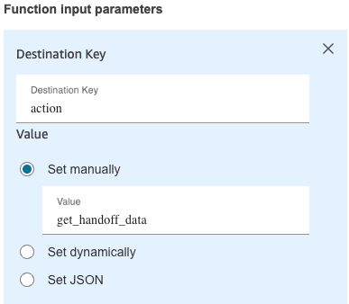

# AWS Connect PSTN Transfer

[](https://github.com/cresta/amazon-connect-pstn-transfer/blob/main/infra/cloudformation/template.yaml)

This repo contains the required AWS resources for doing a transfer using PSTN only

- **Lambda Function** (Go and TypeScript implementations available)
- **AWS Connect Flow**

## Table Of Contents
- [AWS Connect PSTN Transfer](#aws-connect-pstn-transfer)
  - [Table Of Contents](#table-of-contents)
  - [Lambda Function Implementations](#lambda-function-implementations)
  - [Lambda Function Overview](#lambda-function-overview)
    - [Configuration](#configuration)
    - [Usage](#usage)
      - [Supported Actions](#supported-actions)
    - [Handoff Response Format](#handoff-response-format)
    - [API Specification](#api-specification)
  - [Connect Flow](#connect-flow)

## Lambda Function Implementations

This repository contains multiple implementations of the Lambda function, all functionally equivalent:

### Go Implementation
- **Location**: [`lambdas/pstn-transfer-go/`](./lambdas/pstn-transfer-go/)
- **README**: [Go Implementation README](./lambdas/pstn-transfer-go/README.md)
- **Runtime**: Amazon Linux 2023 (Custom Runtime)
- **Architecture**: ARM64
- **Handler**: bootstrap

### TypeScript Implementation
- **Location**: [`lambdas/pstn-transfer-ts/`](./lambdas/pstn-transfer-ts/)
- **README**: [TypeScript Implementation README](./lambdas/pstn-transfer-ts/README.md)
- **Runtime**: Node.js 24+
- **Architecture**: ARM64 or x86_64

Both implementations provide identical functionality and can be used interchangeably. Choose the implementation that best fits your team's expertise and infrastructure requirements.

For implementation-specific details, development setup, and deployment instructions, please refer to the respective README files linked above.

### Build Scripts

The `scripts/` directory contains build scripts for both implementations:

- **`build-go-lambda.sh`**: Builds the Go Lambda function for Linux ARM64
- **`build-typescript-lambda.sh`**: Builds the TypeScript Lambda function
- **`build-all.sh`**: Builds both Go and TypeScript Lambda functions

Usage:
```bash
# Build both Lambda functions
./scripts/build-all.sh

# Or build individually:
# Build Go Lambda
./scripts/build-go-lambda.sh

# Build TypeScript Lambda
./scripts/build-typescript-lambda.sh
```

The `build-all.sh` script will continue building both implementations even if one fails, and report a summary at the end. Exit code 0 indicates all builds succeeded, exit code 1 indicates at least one build failed.

### Running Tests

To run all tests (Go, TypeScript, and shared integration tests) in one command:

```bash
./scripts/test-all.sh
```

This script will:
- Run Go unit tests (`go test ./lambdas/pstn-transfer-go/...`)
- Run TypeScript unit tests (`npm test` in `lambdas/pstn-transfer-ts`)
- Run shared integration tests (`npm test` in `shared/testdata`)

The script will continue running all test suites even if one fails, and report a summary at the end. Exit code 0 indicates all tests passed, exit code 1 indicates at least one test suite failed.

You can also run tests individually:
- **Go tests**: `go test ./lambdas/pstn-transfer-go/...`
- **TypeScript tests**: `cd lambdas/pstn-transfer-ts && npm test`
- **Shared integration tests**: `cd shared/testdata && npm test`

### Linting

To run all linters (Go and TypeScript) in one command:

```bash
./scripts/lint-all.sh
```

This script will:
- Run Go linting (`gofmt -l` and `go vet` for `lambdas/pstn-transfer-go`)
- Run TypeScript linting (`npm run lint` in `lambdas/pstn-transfer-ts`)

The script will continue running all linters even if one fails, and report a summary at the end. Exit code 0 indicates all linters passed, exit code 1 indicates at least one linter found issues.

You can also run linters individually:
- **Go linting**: `gofmt -l ./lambdas/pstn-transfer-go` and `go vet ./lambdas/pstn-transfer-go/...`
- **TypeScript linting**: `cd lambdas/pstn-transfer-ts && npm run lint`
- **TypeScript lint with auto-fix**: `cd lambdas/pstn-transfer-ts && npm run lint:fix`

### Formatting

To format all code (Go and TypeScript) in one command:

```bash
./scripts/format-all.sh
```

This script will:
- Format Go code (`gofmt -w` for `lambdas/pstn-transfer-go`)
- Format TypeScript code (`npm run format` in `lambdas/pstn-transfer-ts`)

The script will continue formatting all code even if one formatter fails, and report a summary at the end. Exit code 0 indicates all code was formatted successfully, exit code 1 indicates at least one formatter failed.

You can also format code individually:
- **Go formatting**: `gofmt -w ./lambdas/pstn-transfer-go`
- **TypeScript formatting**: `cd lambdas/pstn-transfer-ts && npm run format`
- **TypeScript format check (no changes)**: `cd lambdas/pstn-transfer-ts && npm run format:check`

### Shared Integration Tests

- **Location**: [`shared/testdata/`](./shared/testdata/)
- **README**: [Shared Tests README](./shared/testdata/README.md)

The shared integration tests validate that both Go and TypeScript implementations behave identically by running them against a mock HTTP server. To run the shared tests:

```bash
cd shared/testdata
npm install  # First time only
npm test
```

These tests can also be run from the TypeScript lambda directory as part of the full test suite.

## Lambda Function Overview

This AWS Lambda function processes Amazon Connect events and interacts with a virtual agent API to handle PSTN transfers and handoff data.
It provides two main functionalities:
- Returning a phone number and DTMF sequence
- Fetching handoff data

### Configuration

The function accepts the following parameters (either through event parameters or environment variables):
It is recommended to only set `action` via parameter and the rest via environment variable.

- **action**: The action to perform, either `get_pstn_transfer_data` or `get_handoff_data`. Required.
- **region**: AWS region with suffix (e.g., `us-west-2-prod` or `us-west-2-staging`). If not provided, will be extracted from `apiDomain`
- **virtualAgentName**: The resourcename of the virtual agent the call is transferred to. Format: `customers/{customer}/profiles/{profile}/virtualAgents/{virtualAgentID}`. Required.
- **supportedDtmfChars**: DTMF characters supported for PSTN transfer. Defaults to `"0123456789*"`. Can be configured via event parameter or environment variable.

- **apiDomain**: ⚠️ **DEPRECATED** - The domain of the Cresta API. For prod regions, typically `https://api.${cluster}.cresta.com`; for staging regions, `https://api.${cluster}.cresta.ai`. If not provided, will be constructed from `region` using `BuildAPIDomainFromRegion` (defaults to `https://api.us-west-2-prod.cresta.com` for prod regions). Use `region` instead.

#### Authentication

The function supports two authentication methods. You must provide credentials for one of them:

**Option 1: OAuth 2 Client Credentials Flow** ✅ **RECOMMENDED**
- **oauthClientId**: OAuth 2 client ID
- **oauthClientSecret**: OAuth 2 client secret

**Option 2: API Key Authentication** ⚠️ **DEPRECATED**
- **apiKey**: ⚠️ **DEPRECATED** - API key for authentication with the Cresta API. Use OAuth 2 authentication instead.

> **Note**: `apiDomain` and `apiKey` are deprecated. Please migrate to using `region` and OAuth 2 authentication (`oauthClientId`/`oauthClientSecret`) for better security and maintainability.

### Usage

The Lambda function expects an Amazon Connect event with the following structure:

```json
{
  "Details": {
    "ContactData": {
      "ContactId": "...",
      // Other contact data from
    },
    "Parameters": {
      "action": "get_pstn_transfer_data",
      "virtualAgentName": "customers/example/profiles/default/virtualAgents/agent1",
      "region": "us-west-2-prod",
      "oauthClientId": "your-client-id",
      "oauthClientSecret": "your-client-secret",
      "customParameter": "some_custom_value_that_will_be_passed_as_metadata"
    }
  }
}
```

**Example with deprecated API Key authentication (not recommended):**
```json
{
  "Details": {
    "ContactData": {
      "ContactId": "...",
      // Other contact data from
    },
    "Parameters": {
      "action": "get_pstn_transfer_data",
      "virtualAgentName": "customers/example/profiles/default/virtualAgents/agent1",
      "region": "us-west-2-prod",
      "apiDomain": "https://api.us-west-2-prod.cresta.ai",
      "apiKey": "your-api-key",
      "customParameter": "some_custom_value_that_will_be_passed_as_metadata"
    }
  }
}
```


#### Supported Actions

1. `get_pstn_transfer_data`
   - Generates PSTN transfer data for a given contact
   - Requires valid virtual agent name and contact ID

2. `get_handoff_data`
   - Fetches the latest handoff data for BOT conversations
   - Uses contact ID as correlation ID


### Handoff Response Format

All responses are flattened to a map of string key-value pairs, making them compatible with Amazon Connect's response handling. Nested JSON structures are flattened using underscore notation.

e.g.

```json
{
    "handoff_conversation": "customers/cresta/profiles/walter-dev/conversations/51ca9fc2-49ff-48f7-89ef-f3dbebf39239",
    "handoff_conversationCorrelationId": "ee4d8126-134e-4e74-8250-71c7bbf446c5",
    "handoff_summary": "Conversation is too short to generate a summary.",
    "handoff_transferTarget": "pstn:PSTN3"
}
```

### API Specification

An OpenAPI 3.0.0 specification for the used endpoints: `fetchAIAgentHandoff` and `generatePSTNTransferData` is available at [`shared/docs/api-spec.yaml`](./shared/docs/api-spec.yaml). This specification documents the request/response schemas, authentication methods, and error responses for the underlying API endpoints that this Lambda function interacts with.
Make sure to change the domain to the region-specific domain (e.g., `https://api.us-west-2-prod.cresta.com`) before trying it out.

## Connect Flow

The following flow is defined in [./shared/docs/VA_PSTN_Transfer.json](./shared/docs/VA_PSTN_Transfer.json)


1. Call comes into Amazon Connect
2. Amazon Connect calls a lambda function to fetch DTMF sequence and phoneNumber to transfer to
   > - action: `get_pstn_transfer_data`
   > - Response validation is set to JSON
3. It stores the returned values as attributes on the Current Contact
    > 
4. It says the DTMF sequence (for debugging purposes)
5. Amazon Connect transfers the given phone number and enters the DTMF sequence
    > 
6. Upon closure of that call, Amazon Connect continues the flow and calls the lambda function to fetch the Handoff which includes the transfer target.
    > 
    > - action: `get_handoff_data`
    > - Response validation is set to JSON
    
    Note: This will make all Handoff response properties (`handoff_transferTarget`, `handoff_summary`, `handoff_conversation` and `handoff_conversationCorrelationId`) available in the 'External' Namespace. Only `handoff_transferTarget` is used in this example flow.
7.  The transfer target is returned as an attribute
    > `handoff_transferTarget`
    > 
8.  The target is spoken out loud (for debugging purposes)

> **When importing the flow, make sure to change the reference to the lambda function with your own**
