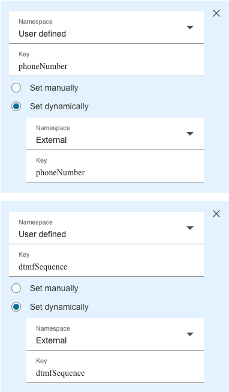

# AWS Connect PSTN Transfer

[](https://github.com/cresta/amazon-connect-pstn-transfer/blob/main/cloudformation/template.yaml)

This repo contains the required AWS resources for doing a transfer using PSTN only

- **Lambda Function**
- **AWS Connect Flow**

## Table Of Contents
- [AWS Connect PSTN Transfer](#aws-connect-pstn-transfer)
  - [Table Of Contents](#table-of-contents)
  - [Lambda function](#lambda-function)
    - [Configuration](#configuration)
    - [Usage](#usage)
      - [Supported Actions](#supported-actions)
    - [Handoff Response Format](#handoff-response-format)
  - [Development Setup](#development-setup)
    - [Prerequisites](#prerequisites)
    - [VS Code Configuration](#vs-code-configuration)
  - [Deployment](#deployment)
    - [Environment Configuration](#environment-configuration)
    - [Manual Deployment](#manual-deployment)
    - [Local Development](#local-development)
  - [Connect Flow](#connect-flow)


## Lambda function

This AWS Lambda function processes Amazon Connect events and interacts with a virtual agent API to handle PSTN transfers and handoff data.
It provides two main functionalities:
- Returning a phone number and DTMF sequence
- Fetching handoff data

### Configuration

The function accepts the following parameters (either through event parameters or environment variables):
It is recommended to only set `action` via parameter and the rest via environment variable.

- **action**: The action to perform, either `get_pstn_transfer_data` or `get_handoff_data`. Defaults to `get_pstn_transfer_data`
- **region**: AWS region with suffix (e.g., `us-west-2-prod` or `us-west-2-staging`). If not provided, will be extracted from `apiDomain`
- **virtualAgentName**: The resourcename of the virtual agent the call is transferred to. Format: `customers/{customer}/profiles/{profile}/virtualAgents/{virtualAgentID}`

- **apiDomain**: ⚠️ **DEPRECATED** - The domain of the Cresta API. Typically `https://api.${cluster}.cresta.ai`. If not provided, will be constructed from `region` (defaults to `https://api.us-west-2-prod.cresta.ai`). Use `region` instead.

#### Authentication

The function supports two authentication methods. You must provide credentials for one of them:

**Option 1: OAuth 2 Client Credentials Flow** ✅ **RECOMMENDED**
- **oauthClientId**: OAuth 2 client ID
- **oauthClientSecret**: OAuth 2 client secret

**Option 2: API Key Authentication** ⚠️ **DEPRECATED**
- **apiKey**: ⚠️ **DEPRECATED** - API key for authentication with the Cresta API. Use OAuth 2 authentication instead.

> **Note**: `apiDomain` and `apiKey` are deprecated. Please migrate to using `region` and OAuth 2 authentication (`oauthClientId`/`oauthClientSecret`) for better security and maintainability.

### Usage

The Lambda function expects an Amazon Connect event with the following structure:

```json
{
  "Details": {
    "ContactData": {
      "ContactId": "...",
      // Other contact data from
    },
    "Parameters": {
      "action": "get_pstn_transfer_data",
      "virtualAgentName": "customers/example/profiles/default/virtualAgents/agent1",
      "region": "us-west-2-prod",
      "oauthClientId": "your-client-id",
      "oauthClientSecret": "your-client-secret",
      "customParameter": "some_custom_value_that_will_be_passed_as_metadata"
    }
  }
}
```

**Example with deprecated API Key authentication (not recommended):**
```json
{
  "Details": {
    "ContactData": {
      "ContactId": "...",
      // Other contact data from
    },
    "Parameters": {
      "action": "get_pstn_transfer_data",
      "virtualAgentName": "customers/example/profiles/default/virtualAgents/agent1",
      "region": "us-west-2-prod",
      "apiDomain": "https://api.us-west-2-prod.cresta.ai",
      "apiKey": "your-api-key",
      "customParameter": "some_custom_value_that_will_be_passed_as_metadata"
    }
  }
}
```


#### Supported Actions

1. `get_pstn_transfer_data`
   - Generates PSTN transfer data for a given contact
   - Requires valid virtual agent name and contact ID

2. `get_handoff_data`
   - Fetches the latest handoff data for BOT conversations
   - Uses contact ID as correlation ID


### Handoff Response Format

All responses are flattened to a map of string key-value pairs, making them compatible with Amazon Connect's response handling. Nested JSON structures are flattened using underscore notation.

e.g.

```json
{
    "handoff_conversation": "customers/cresta/profiles/walter-dev/conversations/51ca9fc2-49ff-48f7-89ef-f3dbebf39239",
    "handoff_conversationCorrelationId": "ee4d8126-134e-4e74-8250-71c7bbf446c5",
    "handoff_summary": "Conversation is too short to generate a summary.",
    "handoff_transferTarget": "pstn:PSTN3"
}
```

## Development Setup

### Prerequisites

- Go 1.x
- AWS CLI configured with appropriate credentials
- Visual Studio Code (recommended)
- ZIP utility

### VS Code Configuration

The project includes VS Code configurations for optimal development:

1. **Required Extensions**:
   - **dfarley1.file-picker**: Required for the `event` task to select test event files. VS Code should prompt you to install this when opening the workspace. Otherwise you can install vsix in the `.vscode` folder.

2. **Recommended Extensions**:
   - Install the recommended Go extensions for VS Code

3. **Debugging**:
   The project includes launch configurations for debugging your Lambda function locally.

4. **Tasks**:
   Predefined tasks are available for building and testing the application. The `event` task requires the `dfarley1.file-picker` extension to select test event files.

## Deployment

### Environment Configuration

Create a `var.json` file in the project root with your environment variables:

**Recommended (OAuth 2 authentication):**
```json
{
    "virtualAgentName": "your-virtual-agent-resource-name",
    "region": "us-west-2-prod",
    "oauthClientId": "your-client-id",
    "oauthClientSecret": "your-client-secret"
}
```

**Deprecated (API Key authentication):**
```json
{
    "virtualAgentName": "your-virtual-agent-resource-name",
    "region": "us-west-2-prod",
    "apiDomain": "https://api.us-west-2-prod.cresta.ai",
    "apiKey": "your-api-key"
}
```

### Manual Deployment

The project includes a `deploy.sh` script in the `scripts` folder that handles the entire deployment process:

It creates a
- **IAM Role**: `aws-lambda-connect-pstn-transfer-role`
  - Includes basic Lambda execution permissions
- **Lambda Function**: `aws-lambda-connect-pstn-transfer`
  - Runtime: Amazon Linux 2023 (Custom Runtime)
  - Architecture: ARM64
  - Handler: bootstrap


```bash
# Make the script executable and run the deployment
cd scripts
chmod +x deploy.sh

PROFILE=<some-aws-profile>
eval "$(aws configure export-credentials --profile $PROFILE --format env)"
./deploy.sh
```

The deployment script will:
1. Build the Lambda function for Linux ARM64
2. Create a deployment package (zip)
3. Create or update the IAM role with necessary permissions
4. Create or update the Lambda function
5. Configure environment variables from `var.json`

### CloudFormation Deployment

The project includes a CloudFormation template for infrastructure-as-code deployment. See the [CloudFormation README](./cloudformation/README.md) for detailed instructions.


### Local Development

1. Export authentication credentials:
   - **Recommended**: For OAuth 2: `export oauthClientId=<client-id>` and `export oauthClientSecret=<client-secret>`
   - **Deprecated**: For API key: `export apiKey=<apiKey>`
2. Export other required variables: `export region=<region>` (e.g., `us-west-2-prod`). `apiDomain` is deprecated and will be constructed from `region` if not provided.
3. Run the `build and debug` function through VS Code's debugger after making changes
4. Use the provided test event in `events/test.json` via `cmd + shift P -> Run Task -> event`
5. Check the debug console for output and response

## Connect Flow

The following flow is defined in [./docs/VA_PSTN_Transfer.json](./docs/VA_PSTN_Transfer.json)


1. Call comes into Amazon Connect
2. Amazon Connect calls a lambda function to fetch DTMF sequence and phoneNumber to transfer to
   > - action: `get_pstn_transfer_data`
   > - Response validation is set to JSON
3. It stores the returned values as attributes on the Current Contact
    > 
4. It says the DTMF sequence (for debugging purposes)
5. Amazon Connect transfers the given phone number and enters the DTMF sequence
    > 
6. Upon closure of that call, Amazon Connect continues the flow and calls the lambda function to fetch the Handoff which includes the transfer target.
    > 
    > - action: `get_handoff_data`
    > - Response validation is set to JSON
    
    Note: This will make all Handoff response properties (`handoff_transferTarget`, `handoff_summary`, `handoff_conversation` and `handoff_conversationCorrelationId`) available in the 'External' Namespace. Only `handoff_transferTarget` is used in this example flow.
7.  The transfer target is returned as an attribute
    > `handoff_transferTarget`
    > 
8.  The target is spoken out loud (for debugging purposes)

> **When importing the flow, make sure to change the reference to the lambda function with your own**
